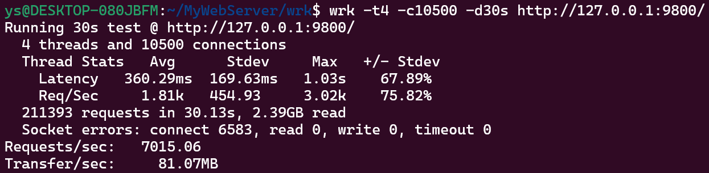
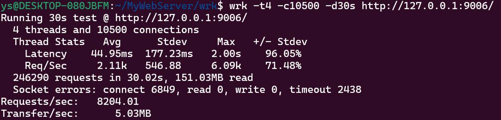
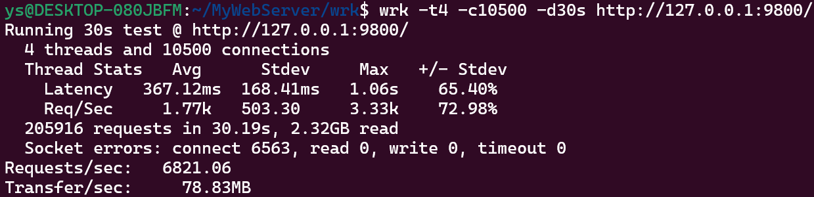
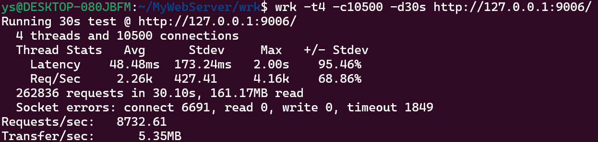
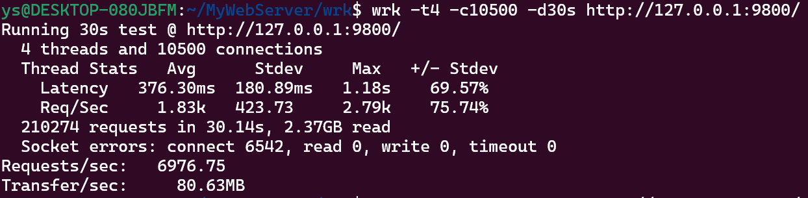
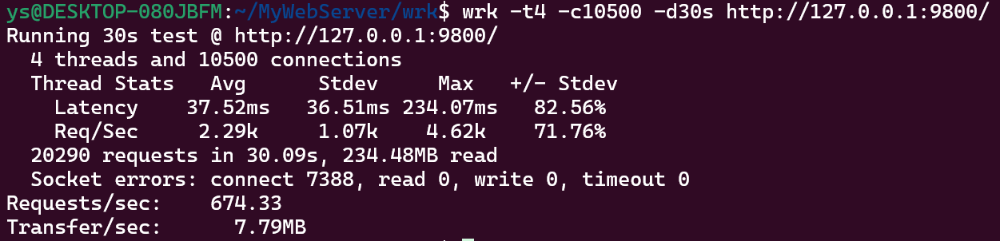

# MyWebServer

一个基于 C++11 实现的轻量级 Web 服务器项目。

## 整体流程

1. `main.cpp` 解析命令行参数，初始化日志和数据库连接池。
2. `webServer` 创建主反应堆和线程池。
3. 主反应堆负责监听 `listen fd`(线程数量为0时主反应堆既负责`lfd`也负责`cfd`)，接收到新连接后按轮询分发给子反应堆。
4. 子反应堆负责连接读写、HTTP 解析、响应发送和连接超时管理。
5. `HttpConnection` 处理具体的 HTTP 请求和响应逻辑。

## 模块

- `buffer/`：读写缓冲区
- `channel/`：文件描述符事件封装
- `config/`：命令行参数与运行配置
- `dispatcher/`：Reactor 抽象及 `epoll/poll/select` 实现
- `http_conn/`：HTTP 连接处理
- `log/`：同步/异步日志系统
- `sql_conn_pool/`：MySQL 连接池
- `threadpool/`：工作线程与线程池
- `timer/`：连接超时链表
- `source/`：静态页面资源

## 特点

- 支持 `epoll`、`poll`、`select` 三种 I/O 复用
- 支持 LT / ET 触发模式
- 子反应堆内部使用 `timerfd` 每 5 秒检查一次空闲连接
- 支持基础的登录、注册和静态文件访问
- 使用 `fmt` 做日志和响应字符串格式化

## 压力测试
在关闭日志后，使用wrk对服务器进行压力测试,并与 [TinyWebServer](https://github.com/qinguoyi/TinyWebServer) 做对比。

wrk安装方式如下：
```shell
// 源码方式编译安装
git clone https://github.com/wg/wrk.git
cd wrk && make
```
> LT模式

> * our

<div align=center> </div>

> * TinyWebServer
<div align=center> </div>

> ET模式

> * our

<div align=center> </div>

> * TinyWebServer

<div align=center> </div>

poll压力测试

<div align=center> </div>

select压力测试

<div align=center> </div>

## 依赖库

### 1. fmt

- 用于日志模块和 HTTP 响应中字符串的格式化
- 项目中使用的是 `fmt::format(...)`

Ubuntu / Debian 安装命令：

```shell
sudo apt update
sudo apt install -y libfmt-dev
```

### 2. mysqlcppconn

- 即 MySQL Connector/C++
- 用于 `sql_conn_pool/` 和 `http_conn/` 中的数据库访问
- 主要提供 `sql::Connection`、`PreparedStatement`、`ResultSet` 等接口

Ubuntu / Debian 安装命令：

```shell
sudo apt update
sudo apt install -y libmysqlcppconn-dev
```

## 启动参数说明


| 参数 | 长参数 | 说明 | 默认值 |
| --- | --- | --- | --- |
| `-p` | `--port` | 监听端口 | `10000` |
| `-l` | `--log-enable` | 是否开启日志，支持 `0/1`、`true/false` | `1` |
| `-m` | `--log-mode` | 日志模式，支持 `sync` / `async` | `sync` |
| `-s` | `--sql-connections` | 数据库连接池大小 | `8` |
| `-t` | `--threads` | 工作线程数量 | `hardware_concurrency()` |
| `-r` | `--reactor` | I/O 复用后端，支持 `epoll` / `poll` / `select` | `epoll` |
| `-g` | `--trigger` | 触发模式，支持 `lt` / `et` | `lt` |
| `-h` | `--help` | 打印帮助信息 | 无 |

说明：

- 当 `threads=0` 时，不创建子线程，由主反应堆直接处理连接
- `poll` 和 `select` 模式下不会使用 ET，程序会自动退回到 `LT`
- `trigger=et` 只有在 `reactor=epoll` 时才真正生效

启动示例：

```shell
./tinyWebServer -p 8080 -l 1 -m async -s 8 -t 4 -r epoll -g et
```
## 致谢
感谢 [qinguoyi/TinyWebServer](https://github.com/qinguoyi/TinyWebServer) 开源项目提供的思路参考。  
同时感谢丙哥的技术分享与教程，博客地址：[https://subingwen.cn/](https://subingwen.cn/)
